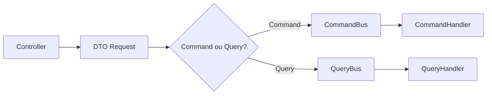
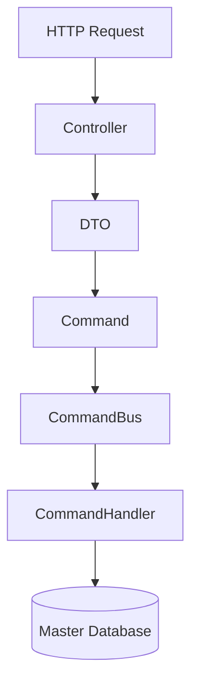
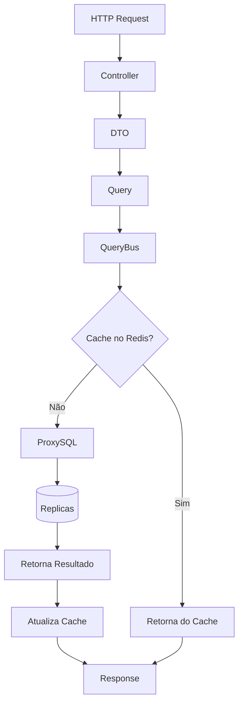

# 🚀 API Java com Spring — Arquitetura CQRS com Cache Distribuído

## 📌 Visão Geral

Este projeto é uma API desenvolvida em **Java com Spring**, baseada no padrão **CQRS (Command Query Responsibility Segregation)**, utilizando **CommandBus** e **QueryBus** para segregação de responsabilidades.

A arquitetura foi projetada para:

- Separar claramente operações de escrita e leitura  
- Melhorar performance de consultas com cache distribuído  
- Escalar leituras via réplicas de banco de dados  
- Garantir organização e baixo acoplamento através de handlers  

---

## 🏗️ Arquitetura Geral



---

## 📚 CQRS na Prática

### ✅ Fluxo de Escrita (Command)



**Características:**
- Operações de escrita
- Retorno: `Result<Void>`
- Escritas direcionadas ao Master

---

### 🔎 Fluxo de Leitura (Query com Cache Inteligente)



**Estratégia aplicada:**
- Cache-Aside
- Leitura prioritária via Redis
- Fallback para banco via ProxySQL
- Balanceamento automático entre 2 réplicas

---

## 🧠 Cache

- Tecnologia: Redis  
- Padrão: Cache-Aside  
- Objetivos:
  - Reduzir latência
  - Diminuir carga no banco
  - Melhorar throughput de leitura

---

## 🗄️ Banco de Dados

Arquitetura composta por:

- 1 Master (escrita)
- 2 Réplicas (leitura)
- Gerenciamento via ProxySQL

### Estratégia

- Escritas → Master  
- Leituras → Réplicas  
- Balanceamento automático  

Benefícios:

- Alta performance  
- Escalabilidade horizontal  
- Melhor distribuição de carga  

---

## 🧩 Stack Tecnológica

- Java  
- Spring Framework  
- Redis  
- MySQL  
- ProxySQL  
- Arquitetura baseada em CQRS  

---

## 📦 Estrutura Conceitual de Pacotes

```
controller/
dto/
command/
query/
bus/
handler/
repository/
config/
```

---

## 🎯 Benefícios da Arquitetura

- ✔ Separação clara entre leitura e escrita  
- ✔ Alta performance com Redis  
- ✔ Escalabilidade via réplicas  
- ✔ Baixo acoplamento  
- ✔ Código organizado e extensível  
- ✔ Fácil manutenção  
- ✔ Preparado para ambientes distribuídos  

---

## 🚀 Possíveis Evoluções

- EventBus  
- Event Sourcing  
- Observabilidade com OpenTelemetry  
- Métricas com Prometheus  
- Circuit Breaker (Resilience4j)  
- Estratégia avançada de cache invalidation  
- Evolução para microservices  

---

## 📈 Escalabilidade

A arquitetura permite:

- Escalar API horizontalmente  
- Escalar Redis  
- Adicionar novas réplicas de banco  
- Separação futura em microserviços  

---

## 👨‍💻 Autor

Projeto desenvolvido com foco em:

- Arquitetura limpa  
- Performance  
- Escalabilidade  
- Boas práticas de engenharia de software  
